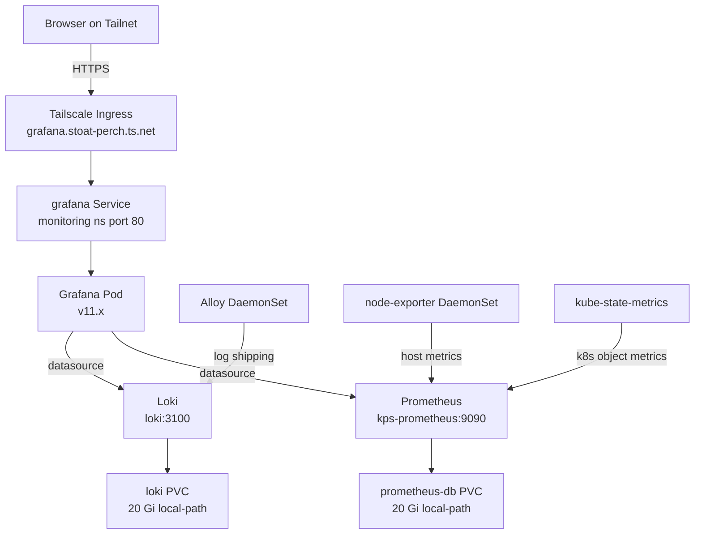

# Monitoring — Architecture

**On this page:** [Deployment diagram](#deployment-diagram) · [Components](#components) · [Namespace](#namespace) · [How metrics reach Grafana](#how-metrics-reach-grafana) · [How logs reach Grafana](#how-logs-reach-grafana) · [Storage](#storage) · [Design decisions](#design-decisions)

## Deployment diagram



## Components

| Component | Role | Chart |
|---|---|---|
| **Prometheus** (Operator-managed) | Scrapes metrics every 30s from all targets; stores in TSDB (7-day retention) | `kube-prometheus-stack` 86.1.0 |
| **Grafana** 11.x | Visualization UI — single pane of glass for metrics + logs | bundled in kube-prometheus-stack |
| **Alertmanager** | Alert routing (no notification channels wired in v1) | bundled |
| **kube-state-metrics** | Exports Kubernetes object state as Prometheus metrics | bundled |
| **node-exporter** (DaemonSet) | Exports host-level CPU/memory/disk/network metrics | bundled |
| **Loki** 3.6.7 SingleBinary | Log aggregation store; 7-day retention | `grafana/loki` 7.0.0 |
| **Grafana Alloy** (DaemonSet) | Log shipper — tails pod logs on every node, ships to Loki | `grafana/alloy` 1.8.2 |

## Namespace

All components run in the `monitoring` namespace. Custom app metrics scraped from the `homelab` namespace via `ServiceMonitor` CRDs.

## How metrics reach Grafana

```
App pod (/actuator/prometheus or /metrics)
  → ServiceMonitor CRD (in app's namespace)
  → Prometheus operator picks it up
  → Prometheus scrapes on schedule
  → Grafana queries Prometheus via datasource
```

## How logs reach Grafana

```
App pod stdout/stderr
  → Alloy DaemonSet (reads /var/log/containers/*.log)
  → Alloy labels with {namespace, app, pod, container, node}
  → Loki push API (http://loki.monitoring.svc.cluster.local:3100/loki/api/v1/push)
  → Grafana queries Loki via datasource (LogQL)
```

## Storage

| PVC | Size | Purpose |
|---|---|---|
| `prometheus-kps-prometheus-db-prometheus-kps-prometheus-0` | 20 Gi | Prometheus TSDB (7-day retention) |
| `storage-loki-0` | 20 Gi | Loki chunks + index (7-day retention) |
| `grafana` | 5 Gi | Grafana dashboards, plugins, sqlite |
| `alertmanager-kps-alertmanager-db-…` | 1 Gi | Alertmanager state |

All on `local-path` (OrbStack VM ext4) — never on the HFS+ HDD (file-descriptor exhaustion risk).

## Design decisions

- **kube-prometheus-stack** — installs Prometheus, Grafana, Alertmanager, kube-state-metrics, and node-exporter in one Helm chart. Standard in the k8s ecosystem.
- **Loki SingleBinary** — simpler to operate than distributed mode; perfectly sized for a one-node homelab.
- **Alloy over Promtail** — Grafana's next-generation agent; replaces Promtail. Better multi-pipeline support.
- **No notification channels (v1)** — Alertmanager is installed but not wired. Sufficient for personal homelab; add email/Slack/PagerDuty when needed.
- **local-path only** — monitoring data is ephemeral (7 days). Using SSD avoids the HFS+ fd exhaustion that plagued hostPath mounts to the external HDD.
